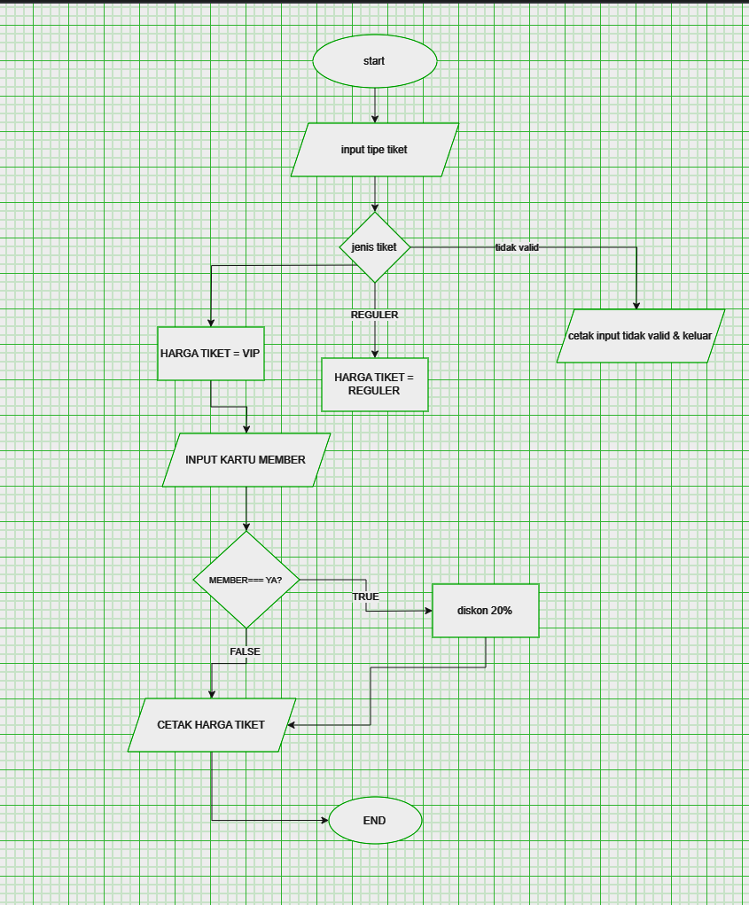
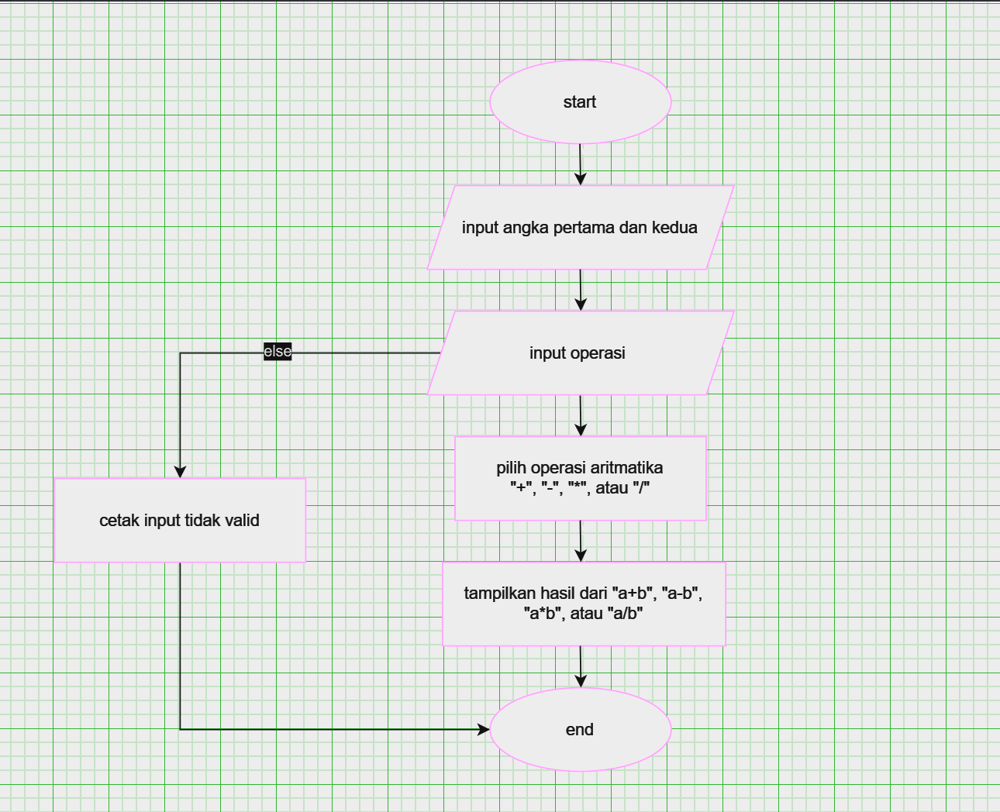

## Program Diskon Harga Tiket
Program ini adalah program kalkulator harga tiket yang menghitung total biaya tiket berdasarkan dua faktor utama: tipe tiket (reguler atau VIP) dan status keanggotaan (apakah pengguna memiliki kartu member atau tidak)

## Deskripsi Program
Program ini dibuat menggunakan bahasa python dengan fitur:

1. Input dan Output: input(): Untuk menerima masukan dari pengguna. print(): Untuk menampilkan output ke konsol.
2. Tipe Data: String: Menyimpan tipe tiket dan status member sebagai teks. Integer: Menggunakan harga tiket sebagai angka.
3. Pengkondisian: if, elif, dan else: Untuk menentukan harga tiket berdasarkan input pengguna dan memberikan diskon jika pengguna adalah anggota.
4. Operasi Aritmetika: Menghitung total harga dengan mengalikan harga tiket dan mengurangi 20% jika pengguna memiliki kartu member.
5. Fungsi lower(): Untuk mengubah input menjadi huruf kecil, sehingga memudahkan validasi.
6. Penggunaan List: Menggunakan in untuk memeriksa validitas tipe tiket dalam list yang berisi "reguler" dan "vip".

## Flowchart Diskon


## Kode Program Diskon
```python
# harga tiket
harga_reguler = 50000
harga_vip = 100000

# input tipe tiket
tipe_tiket = input ("masukan tipe tiket (reguler/vip): ").lower()

# input status member
status_member = input("apakah anda memiliki kartu member? (ya/tidak): ").lower()

# menentukan harga tiket berdasarkan tipe tiket dan member
if tipe_tiket == "reguler":
    harga_tiket = harga_reguler
elif tipe_tiket == "vip":
    harga_tiket = harga_vip
else:
    print("tipe tiket tidak valid.")
    exit()

# menghitung harga dengan diskon jika pengguna adalah member
if status_member== "ya":
    total_harga = harga_tiket * 0.8 #diskon 20%
else:
    total_harga = harga_tiket

# output total harga yang harus dibayar 
print("total harga yang harus dibayar: Rp", int(total_harga))
```

## Output Program Diskon
```
PS C:\Users\user\Documents\Kuliah> & C:/Users/user/AppData/Local/Programs/Python/Python312/python.exe c:/Users/user/Documents
/Kuliah/lab2py/pemrograman/tiket.py
masukan tipe tiket (reguler/vip): reguler apakah anda memiliki kartu member? (ya/tidak): ya
total harga yang harus dibayar Rp 40000
PS C:\Users\user\Documents\Kuliah> & C:/Users/user/AppData/Local/Programs/Python/Python312/python.exe c:/Users/user/Document
/Kuliah/lab2py/pemrograman/tiket.py masukan tipe tiket (reguler/vip): vip
apakah anda memiliki kartu member? (ya/tidak): ya
total harga yang harus dibayar: Rp 80000
PS C:\Users\user\Documents\Kuliah>
```

## Cara Kerja Program
1. Mulai (_start_)
2. _Input Tipe Tiket_ : pengguna memasukan jenis tiket, yaitu berupa REGULER dan VIP
3. _Program memeriksa pilihan tiket_ :
   - Jika pengguna memilih "_reguler_", harga tiket di-set ke harga reguler.
   - Jika memilih "_VIP_", harga tiket di-set ke harga VIP.
   - Jika pilihan tidak valid, program memberi tahu pengguna dan berhenti.
5. _input Status Member_ : Program kemudian bertanya apakah pengguna memiliki kartu member dengan jawaban "_ya_" atau "_tidak_". Jawaban ini juga diubah menjadi huruf kecil.
6. _Program memeriksa apakah pengguna adalah member_ :
   - Jika "_ya_", total harga dihitung dengan diskon 20%.
   - Jika "_tidak_", total harga sama dengan harga tiket yang dipilih.
6. Akhir (_End_) : proses selesai

## Program Kalkulator Sederhana
Program ini adalah kalkulator sederhana yang memungkinkan pengguna untuk melakukan operasi aritmatika dasar: penjumlahan, pengurangan, perkalian, dan pembagian. Program ini ditulis dalam Python dan menggunakan input dari pengguna untuk mendapatkan angka dan jenis operasi yang diinginkan.

## Deskripsi Program
program ini dibuat menggunakan bahasa python dengan fitur :

Memungkinkan pengguna untuk memasukkan dua angka.
Mendukung empat operasi aritmatika:
Penjumlahan (+)
Pengurangan (-)
Perkalian (*)
Pembagian (/)
Menangani pembagian dengan nol dengan pesan kesalahan yang sesuai.
Menawarkan opsi untuk melakukan perhitungan baru setelah hasil ditampilkan.

## Flowchart Kalkulator


## program kalkulator
```python
angka1 = float(input("Masukkan angka pertama: "))
angka2 = float(input("Masukkan angka kedua: "))

print("Pilih operasi aritmatika:")
print("1. Penjumlahan (+)")
print("2. Pengurangan (-)")
print("3. Perkalian (*)")
print("4. Pembagian (/)")
operator = input("Masukkan pilihan operasi (+, -, *, /): ")

if operator == '+':
    hasil = angka1 + angka2
    print("Hasil dari penjumlahan:", hasil)
elif operator == '-':
    hasil = angka1 - angka2
    print("Hasil dari pengurangan:", hasil)
elif operator == '*':
    hasil = angka1 * angka2
    print("Hasil dari perkalian:", hasil)
elif operator == '/':
    if angka2 != 0:
        hasil = angka1 / angka2
        print("Hasil dari pembagian:", hasil)
    else:
        print("Error: Pembagian dengan nol tidak diperbolehkan.")
else:
    print("Operator tidak valid. Silakan pilih (+, -, *, /).")
```

## Ouutput Program
```
s/Kuliah/lab2py/pemrograman/input latihan 3.py"
Masukkan angka pertama: 1600
Masukkan angka kedua: 2000
Pilih operasi aritmatika:
1. Penjumlahan (+)
2. Pengurangan (-)
3. Perkalian (*)
4. Pembagian (/)
Masukkan pilihan operasi (+, -, *, /): *
Hasil dari perkalian: 3200000.0
PS C:\Users\user\Documents\Kuliah> & C:/Users/user/AppData/Local/Programs/Python/Python312/python.exe "c:/Users/user/Document
```

## Cara Kerja Program
1. _Input Angka_ : Program meminta pengguna untuk memasukkan dua angka, yaitu angka1 dan angka2. Kedua angka ini diubah menjadi tipe float agar bisa digunakan untuk operasi desimal.
2. _Tampilkan Pilihan Operasi_ : Program menampilkan menu pilihan operasi aritmatika: penjumlahan, pengurangan, perkalian, dan pembagian.
3. _Input Operator_ : Program meminta pengguna untuk memilih operasi aritmatika dengan memasukkan simbol (+, -, *, /).
4. _Eksekusi Operasi_ : Program memeriksa operator yang dimasukkan:
    - Jika operator adalah +, program menjumlahkan kedua angka dan menampilkan hasilnya.
    - Jika operator adalah -, program mengurangkan angka2 dari angka1 dan menampilkan hasilnya.
    - Jika operator adalah *, program mengalikan kedua angka dan menampilkan hasilnya.
    - Jika operator adalah /, program memeriksa apakah angka2 tidak sama dengan nol. Jika tidak nol, program membagi angka1 dengan angka2 dan menampilkan hasilnya. Jika angka2 adalah nol, program menampilkan pesan kesalahan karena pembagian dengan nol tidak diperbolehkan.
  -Jika operator tidak valid, program menampilkan pesan bahwa operator yang dimasukkan tidak valid.
5. _Output Hasil_ : Program menampilkan hasil dari operasi yang dipilih
